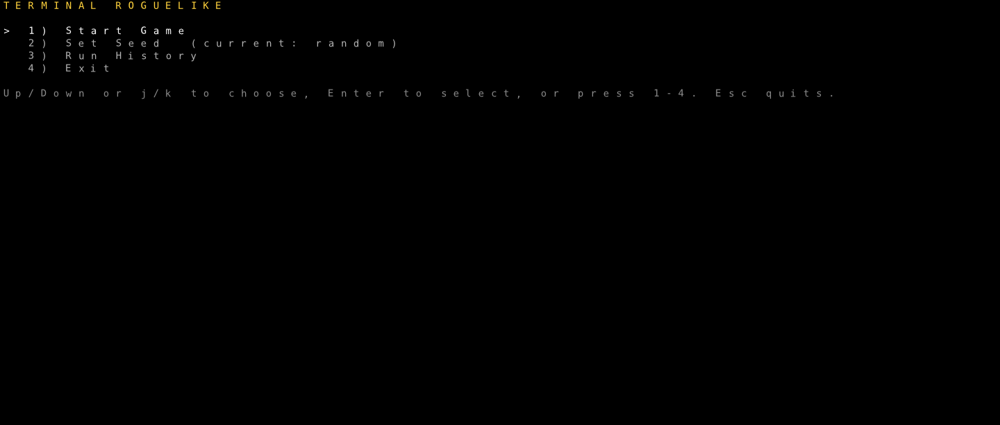
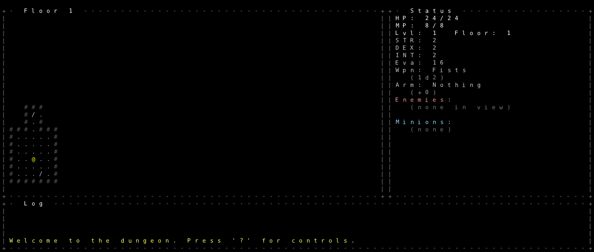
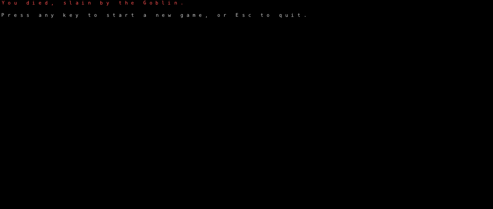
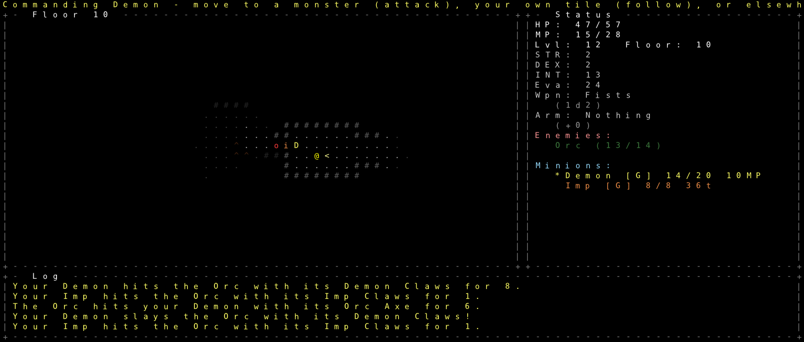
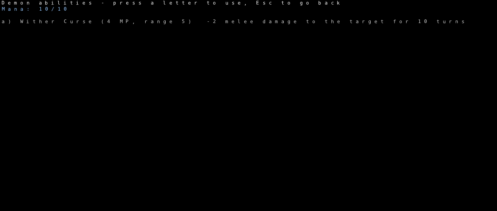
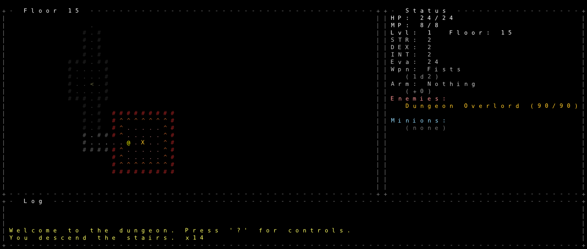
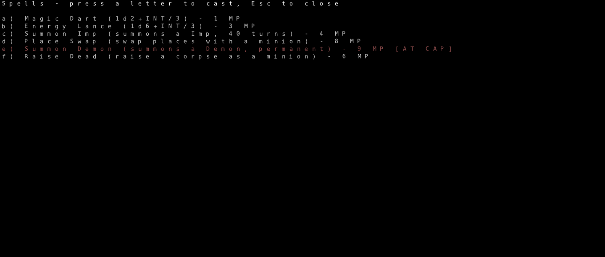

# Terminal Roguelike

A turn-based, permadeath, ASCII fantasy dungeon crawler, written in modern
C++17 using [libtcod](https://github.com/libtcod/libtcod) — built around
**granular control over minions**. Go the Summoner route and you're not
following one pet around: raise or summon a whole pack (up to 7 at once —
each minion type guards its own independent cap, so summoning more Imps
never crowds out room for a Demon or a raised corpse), then command each
member individually — hold a chokepoint, focus a specific target, trigger
one minion's own ability — or give the pack a single order at once. That
per-minion command layer (`o`/`p` to cycle between them, `m` for the full
roster) is the mechanic the rest of the game is built around, not a
bolted-on pet system.

## About this project

This game is built with [Claude Code](https://claude.com/claude-code), an AI
coding agent, as a test of its capabilities on a non-trivial C++ project. The
README and code comments are also written by Claude Code.

## Screenshots

| Start menu | Fresh start | Death screen |
| --- | --- | --- |
|  |  |  |

The headline mechanic in action — commanding a pack individually, mid-fight:

| Commanding minions in a fight | A minion ability |
| --- | --- |
|  |  |

A few more from an actual run:

| Floor 15's boss chamber | Summoner spell list |
| --- | --- |
|  |  |

## One-time setup (Linux)

You need `git`, `cmake`, a C++ compiler, and `ninja` (recommended, faster than
default make). On Debian/Ubuntu:

```bash
sudo apt update
sudo apt install -y git cmake g++ ninja-build build-essential \
    pkg-config autoconf libtool
```

(`autoconf`/`libtool` are needed because vcpkg builds some of SDL3's
dependencies from source on Linux.)

On Fedora:

```bash
sudo dnf install -y git cmake gcc-c++ ninja-build pkgconf autoconf libtool
```

On Arch:

```bash
sudo pacman -S git cmake gcc ninja pkgconf autoconf libtool
```

## Build

```bash
# 1. Clone this repo, including the vcpkg submodule (only needed once)
git clone --recurse-submodules <this-repo-url>
cd <repo-directory>

# 2. Configure (this step will download & compile SDL3 + libtcod via vcpkg
#    the first time — expect this to take several minutes)
cmake -B build -S . -G Ninja

# 3. Build
cmake --build build

# 4. Run
./build/bin/roguelike
```

After the first configure, steps 3–4 are all you need when you change code.
If you add new .cpp files, re-run step 2 so CMake picks them up.

If you already have the folder locally without having cloned it (e.g. you
downloaded it some other way), run `git submodule update --init` instead of
step 1.

Launches to a start menu (Start Game / Set Seed / Run History / Exit) — Run
History remembers past runs (win or death, floor, level, seed) across
launches. Controls in a run are all in-game — press `?` any time for the
full reference.

## Debug flags

Not for normal play: `--floor=N` jumps straight to floor N; `--level=N`
starts at player level N; `--reveal` shows the whole current floor regardless
of exploration/FOV; `--dump-loot` prints everything on the `--floor=N` floor
and exits without opening a window; `--fast-monsters` gives every hostile
monster a second action per turn; `--give=<name>[,...]` adds items to your
inventory at startup; `--seed=N` pins the RNG for a reproducible run.
`--seed=N` + `--dump-loot`, diffed across floors, is this project's one
regression check. Any of the above (or `--skip-menu`, which does nothing
else) skips the start menu and drops straight into play. `--start-dead`
forces up the death screen against a placeholder cause, and
`--screenshot=<path>` renders one frame and saves it, both mainly for
capturing reference images headlessly (`SDL_VIDEODRIVER=offscreen`) without
a real display.

## Project layout

```
roguelike/
├── CMakeLists.txt      # build configuration
├── vcpkg.json          # dependency manifest (libtcod, sdl3)
├── src/
│   ├── main.cpp             # entry point: argv, window, main loop
│   │
│   │                        # primitives
│   ├── entity.hpp/.cpp      # Weapon/Armor/Potion/Actor types, damage rolls
│   ├── map.hpp/.cpp         # dungeon generation, FOV, fog of war, pathfinding
│   ├── rng.hpp/.cpp         # shared random-number and dice-rolling utility
│   ├── run_history.hpp/.cpp # persisted past-run records (Run History menu)
│   │
│   │                        # content and numbers
│   ├── content.hpp/.cpp     # the weapon/armor/potion/monster/minion tables
│   ├── spells.hpp/.cpp      # the spell table and what the player knows
│   ├── rules.hpp/.cpp       # tuning constants, derived stats, the combat formula
│   │
│   │                        # the world
│   ├── actors.hpp/.cpp      # queries and phrasing over a floor's Actor list
│   ├── projectile.hpp/.cpp  # spells and shots in flight, and their geometry
│   ├── level.hpp/.cpp       # one floor: its map, monsters, items, generation
│   │
│   │                        # the game
│   ├── game.hpp/.cpp        # GameState and the operations on it
│   ├── turn.hpp/.cpp        # what the world does between two player actions
│   ├── render.hpp/.cpp      # screen layout and every function that draws
│   └── input.hpp/.cpp       # one keyboard handler per mode
└── vcpkg/               # (created by you) vendored package manager
```

Each layer only depends on the ones above it. A new weapon or monster is a row
in `content.cpp`; a new spell is a row in `spells.cpp` plus however it resolves;
a new full-screen menu is a `Mode` in `game.hpp`, a render function, an input
handler, and a key to open it.

## Status

Everything below is built and playable.

- **Minions** — the headline mechanic: summon (Imp/Demon) or raise the
  corpse of whatever you just killed, then command your pack individually
  (`o`/`p` to cycle, `m` for the full roster) with per-unit orders — Follow,
  Hold a position, or focus-fire a specific target — or issue one order to
  everyone at once. Minions get their own abilities too (the Demon's Wither
  Curse), independent per-source caps stacking up to 7 allies at a time.
- **World** — procedural multi-level dungeon, FOV/fog of war, pits, depth-scaled
  monsters and gear; the last floor has a distinct, moat-ringed boss chamber
- **Combat** — turn-based melee and ranged (`f`), permadeath, one shared
  accuracy/dodge/armor formula for every attacker, player or monster
- **Character** — Strength/Dexterity/Intelligence leveling, HP/mana regen,
  weapons/armor/potions with pickup, equip and drop
- **Magic** — three spell schools chosen at Intelligence 4 (Caster: Fireball,
  Sandstorm, Lightning Bolt; Summoner: summons, Raise Dead, Place Swap; Combat
  Mage: Battle Fury, Iron Skin, Haste), shared mana pool, Haste-granted extra
  actions
- **Monsters** — the same combat math as the player, A* chase AI, ranged
  specialists (Goblin Slinger, Orc Archer), casters (Goblin Shaman, Orc
  Wizard), and three bosses — Orc Warlord (floor 3), Troll Chieftain (floor
  6), and the Dungeon Overlord, the win condition, in its own chamber on the
  last floor
- **Interface** — start menu with a persistent Run History, sectioned HUD
  (stats, buffs, enemies, minions), scrollback message log, look-around (`x`)

## Where Claude struggled

Since the point of this project is testing an AI agent on a real C++ codebase,
the places it did badly are worth recording, not just the features that landed.
Each entry is what went wrong, and why — written after the fact, once the thing
actually worked.

### Shift+direction travel

Roughly thirty lines of movement code. It took five commits and shipped three
separate regressions, two of which made the game worse than not having the
feature at all.

The first version — travel until a monster comes into view or something blocks
you — was fine. Everything after that was Claude breaking it:

1. **Stopping at corridor branches.** The first attempt asked "is the tile
   beside me walkable?", which is true of *every* tile in a corridor that
   happens to be two tiles wide. Travel stopped dead after every single step.
2. **Stopping a tile earlier.** Asked to halt one tile before whatever triggered
   the stop, Claude moved every check to run *before* the step instead of after.
   That silently changed each condition from "something just happened" into "a
   property of the tile I'm standing on" — so the exact tile a run stopped on
   would refuse to start the next run from that spot. Every stop became a
   permanent wall, and a single visible monster froze travel entirely. The
   player could get stuck in a corner with no way to travel out.
3. **Ignoring rooms.** Branch detection was gated to corridors only, so travel
   walked straight past an opening the player was standing next to in a room.

What finally fixed it was the user describing the actual geometric rule — check
each side independently for a wall that ends one step ahead — rather than Claude
patching the symptom it had just been shown.

Three things stand out:

- **Symptom-patching instead of testing the geometry.** Each round, Claude
  eyeballed the logic, decided it looked right, and shipped it. When the fix that
  finally worked was checked against 21 hand-drawn maps in a throwaway harness,
  that harness immediately caught several cases Claude had reasoned about
  incorrectly moments earlier. It should have been written three commits sooner.
- **Not noticing that a refactor changed meaning.** "Move the checks earlier" was
  treated as a scheduling change when it was really a semantic one. Nothing in
  the diff looked wrong; the deadlock was only visible from thinking about what
  the conditions now *meant*.
- **Manual playtesting hid it.** The project has no automated tests, so every one
  of these reached the user before anyone noticed. The build was clean and the
  one regression check the project does have (`--seed` + `--dump-loot`) covers
  world generation, which this code doesn't touch — so it passed, every time,
  while the feature was broken.
